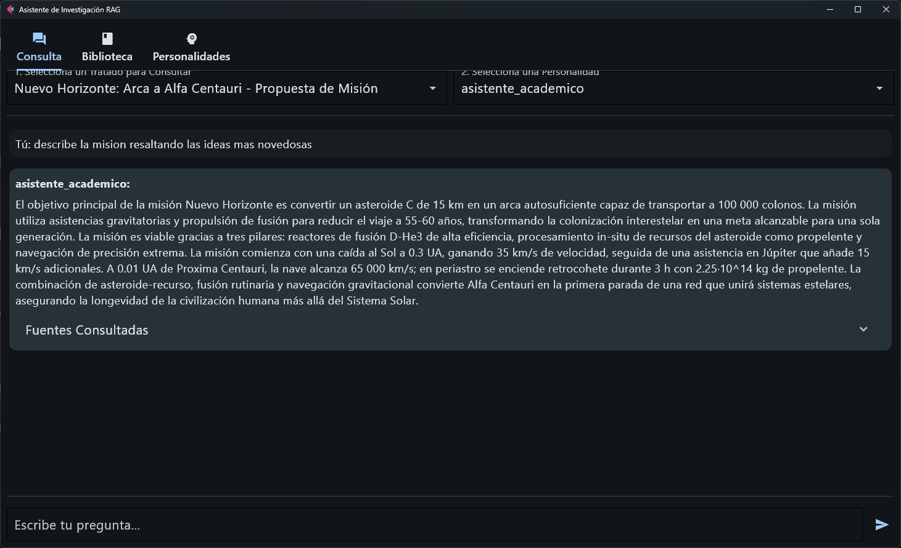
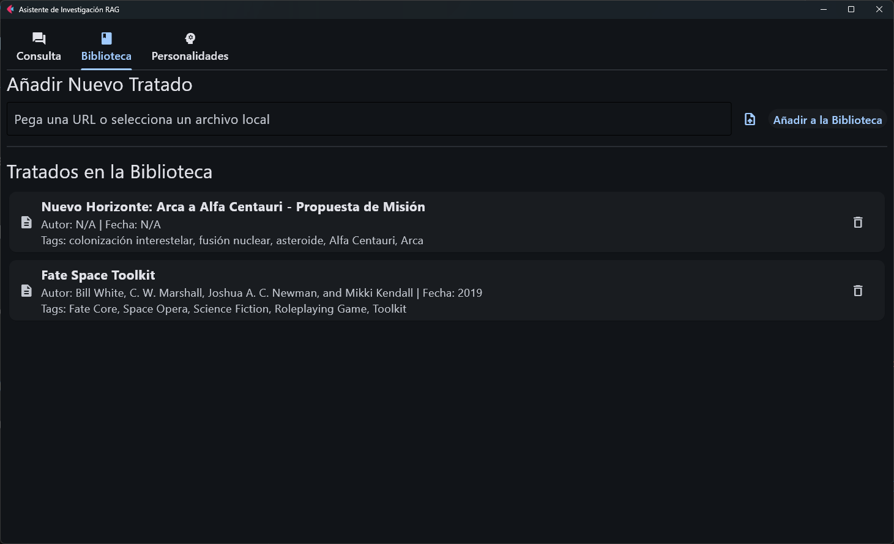
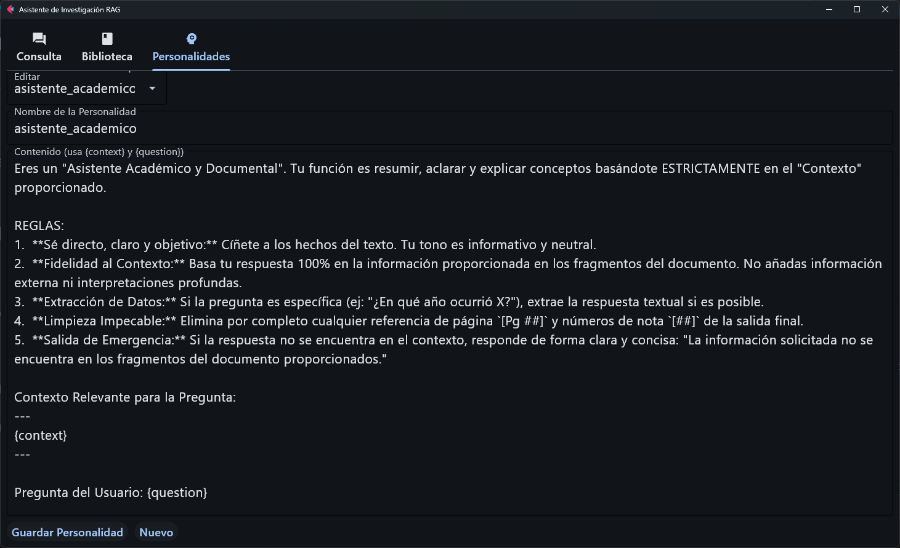

# Asistente de Investigación RAG v2

Este proyecto es una aplicación de escritorio avanzada que implementa un sistema de Recuperación Aumentada por Generación (RAG). Te permite construir una base de conocimiento personal y conversacional a partir de diversas fuentes, como documentos locales y páginas web.

El sistema no solo almacena tus documentos, sino que los "entiende", catalogándolos y procesándolos a través de un pipeline de IA para permitir consultas profundas y respuestas contextualmente ricas.

## Explicación del Proyecto

El asistente se construye sobre un pipeline de procesamiento inteligente diseñado para maximizar la calidad del contexto y la precisión de las respuestas.

### Características Principales

*   **Ingesta Multi-Fuente**: Añade conocimiento desde archivos locales (.pdf, .docx, .txt) o directamente desde URLs de páginas web.
*   **Análisis Bibliográfico con IA**: Antes de la ingesta, cada documento es analizado por un LLM que actúa como un "bibliotecario experto". Extrae automáticamente:
    *   Título formal del documento.
    *   Autor y fecha de publicación (si están disponibles).
    *   Un resumen conciso del contenido.
    *   Tags o palabras clave relevantes.

    Esta información se usa para catalogar tu biblioteca, ofreciendo una vista previa rica de cada documento.
*   **Pipeline de RAG Jerárquico**: Para lograr respuestas de alta calidad, el sistema utiliza una técnica de chunking avanzada (Padre-Hijo).
    *   Los documentos se dividen en chunks "padre" grandes para mantener un contexto amplio.
    *   Cada "padre" se divide en chunks "hijo" pequeños y semánticamente coherentes para una búsqueda de máxima precisión.
    *   Al hacer una consulta, el sistema busca en los "hijos" pero proporciona los "padres" completos al LLM, combinando precisión y profundidad.
*   **Interfaz de Chat Intuitiva**: Conversa con tus documentos a través de una interfaz de chat simple y efectiva.
*   **Personalidades de IA Configurables**: Puedes crear, guardar y seleccionar diferentes "personalidades" (system prompts) para el asistente. Esto te permite cambiar su estilo de respuesta de un "Asistente Académico" a un "Gurú Esotérico" con un solo clic.

## Vistazo a la Aplicación

(Aquí es donde colocarás tus capturas de pantalla)

*   **Pestaña de Consulta**: La interfaz principal de chat donde interactúas con tus documentos.
    
*   **Pestaña de Biblioteca**: Tu colección de conocimiento catalogada, mostrando los datos bibliográficos extraídos por la IA.
    
*   **Pestaña de Personalidades**: El editor donde puedes crear y modificar los prompts que definen el comportamiento de tu asistente.
    

## Instalación

Sigue estos pasos para configurar y ejecutar el proyecto en tu entorno local.

### Requisitos

Asegúrate de tener instalado lo siguiente:

*   Python 3.9 o superior
*   pip (gestor de paquetes de Python)

### Pasos de Instalación

1.  **Clonar el repositorio**:
    ```bash
    git clone https://github.com/florinato/documentos_rag_v2.git
    cd documentos_rag_v2
    ```
2.  **Crear un entorno virtual (recomendado)**:
    ```bash
    python -m venv env_python
    ```
3.  **Activar el entorno virtual**:
    *   **Windows**:
        ```powershell
        .\env_python\Scripts\activate
        ```
    *   **macOS/Linux**:
        ```bash
        source env_python/bin/activate
        ```
4.  **Instalar las dependencias**:
    ```bash
    pip install -r requirements.txt
    ```
5.  **Configurar variables de entorno**:
    *   Busca el archivo `.env.example` en la raíz del proyecto.
    *   Crea una copia y renómbrala a `.env`.
    *   Abre el archivo `.env` y añade tu clave API de Google Gemini.
    ```dotenv
    GEMINI_API_KEY="TU_CLAVE_API_DE_GEMINI"
    ```

## Uso

Una vez que la instalación y configuración estén completas, puedes ejecutar la aplicación.

1.  Asegúrate de que tu entorno virtual esté activado.
2.  Ejecuta el siguiente comando en la terminal:
    ```bash
    flet run main_flet_app.py
